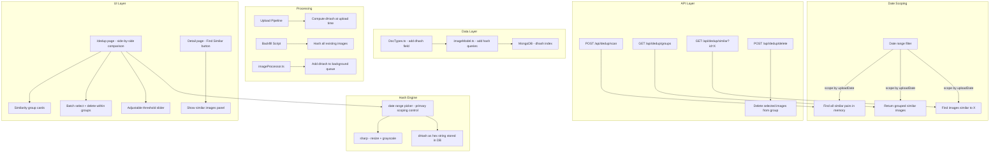

# Deduplication & Similar Image Browsing Plan

## Overview

Add perceptual hashing (dHash) to enable finding visually similar AI-generated images, a dedicated `/dedup` page for side-by-side comparison and curation, and a "Find Similar" feature on the image detail page.

## Current State

| Capability | Status |
|---|---|
| Exact duplicate detection on upload | Exists (SHA-256 hash in `_id`) |
| Batch delete | Exists in `postsSmart` page |
| Single image delete with prev/next nav | Exists in detail page |
| Sort by upload date | Exists (default sort) |
| Perceptual similarity hashing | **Missing** |
| Similar image browsing UI | **Missing** |
| Date range filtering | **Missing** |

## Architecture



## Implementation Steps

### Phase 1: Perceptual Hash Engine

#### 1.1 Create `app/src/lib/server/services/perceptualHash.ts`

Port the Python dHash algorithm to TypeScript using `sharp` (already a dependency):

```typescript
import sharp from 'sharp';

// dHash: difference hash - compares adjacent pixels
// Returns a 64-bit hash as a hex string (16 hex chars)
export async function dhash(buffer: Buffer, hashSize = 8): Promise<string> {
    const { data } = await sharp(buffer)
        .greyscale()
        .resize(hashSize + 1, hashSize, { fit: 'fill' })
        .raw()
        .toBuffer({ resolveWithObject: true });

    let hash = 0n;
    let bitIndex = 0;
    for (let row = 0; row < hashSize; row++) {
        for (let col = 0; col < hashSize; col++) {
            const left = data[row * (hashSize + 1) + col];
            const right = data[row * (hashSize + 1) + col + 1];
            if (left < right) {
                hash |= (1n << BigInt(bitIndex));
            }
            bitIndex++;
        }
    }
    return hash.toString(16).padStart(16, '0');
}

// Hamming distance between two hex-encoded dHash strings
export function hammingDistance(hex1: string, hex2: string): number {
    const h1 = BigInt('0x' + hex1);
    const h2 = BigInt('0x' + hex2);
    let xor = h1 ^ h2;
    let count = 0;
    while (xor) {
        count += Number(xor & 1n);
        xor >>= 1n;
    }
    return count;
}

export const DEFAULT_SIMILARITY_THRESHOLD = 8; // 0-64, lower = more strict
```

#### 1.2 Add `dhash` field to `BaseImage` in `app/src/lib/types/DocTypes.ts`

```typescript
export interface BaseImage {
    // ... existing fields ...
    /** Perceptual difference hash for visual similarity detection (hex string, 16 chars) */
    dhash?: string;
}
```

#### 1.3 Add MongoDB index on `dhash` in `app/src/lib/db.server.ts`

```typescript
client.db(dbName).collection(collections.images).createIndex({ dhash: 1 });
```

### Phase 2: Hash Computation Pipeline

#### 2.1 Compute dHash at upload time

In `app/src/lib/server/controllers/imageController.ts`, inside [`newImage()`](app/src/lib/server/controllers/imageController.ts:137), compute the dHash from the buffer before saving:

```typescript
import { dhash } from '$lib/server/services/perceptualHash';

// After creating imageDataObj, before addImage:
const hash = await dhash(buffer);
imageDataObj.dhash = hash;
```

#### 2.2 Add dHash to background task queue

In `app/src/lib/server/services/taskQueue/imageProcessor.ts`, add dHash computation to [`processImage()`](app/src/lib/server/services/taskQueue/imageProcessor.ts:112) for images that lack it:

- Add a `needsDHash` flag to [`ProcessingTask`](app/src/lib/server/services/taskQueue/imageProcessor.ts:17)
- In [`findImagesNeedingProcessing()`](app/src/lib/server/services/taskQueue/imageProcessor.ts:50), query for images where `dhash` is missing/null
- In [`processImage()`](app/src/lib/server/services/taskQueue/imageProcessor.ts:112), compute and store the dHash

#### 2.3 Create backfill script

Create `app/scripts/backfill-dhash.ts` (standalone script using ts-node):

- Connect to MongoDB directly
- Query all images where `dhash` is missing
- For each, read the image file, compute dHash, update the document
- Process in batches of 10 with progress reporting
- Handle errors gracefully (skip corrupted files)

### Phase 3: Similarity API

#### 3.1 Add model methods to `app/src/lib/server/models/imageModel.ts`

```typescript
// Get all images with dhash (lightweight projection)
async getAllHashes(): Promise<{ _id: string; dhash: string; uploadDate: string; 
    thumbnailPath?: string; originalName: string; imagePath: string }[]> {
    return await imageColl.find({}, { projection: { _id: 1, dhash: 1, uploadDate: 1, 
        thumbnailPath: 1, originalName: 1, imagePath: 1 } });
}

// Get images by IDs (for returning similarity groups)
async getImagesByIds(ids: string[]): Promise<AppImageData[]> {
    return await imageColl.find({ _id: { $in: ids } });
}
```

Note: The `find` in collectionLayer.ts may need a projection parameter added. If not, we can use a lighter query approach or add projection support.

#### 3.2 Create `app/src/lib/server/services/dedupService.ts`

Core service for similarity detection. All scan/group methods accept optional `dateFrom`/`dateTo` parameters to scope the comparison to a date range, reducing the working set and improving performance.

```typescript
interface DateRange {
    dateFrom?: string; // ISO date string, inclusive
    dateTo?: string;   // ISO date string, inclusive
}

class DedupService {
    // Find all groups of similar images, optionally scoped by date range
    async findSimilarGroups(threshold = 8, dateRange?: DateRange): Promise<SimilarGroup[]> {
        const filter: any = { dhash: { $exists: true, $ne: null } };
        if (dateRange?.dateFrom || dateRange?.dateTo) {
            filter.uploadDate = {};
            if (dateRange.dateFrom) filter.uploadDate.$gte = dateRange.dateFrom;
            if (dateRange.dateTo) filter.uploadDate.$lte = dateRange.dateTo;
        }
        const hashes = await ImageModel.getAllHashes(filter);
        // O(n²) comparison - feasible for <50K images
        // Group connected components using Union-Find
        // Return groups with image metadata
    }

    // Find images similar to a specific image, optionally scoped by date range
    async findSimilarToImage(imageId: string, threshold = 8, dateRange?: DateRange): Promise<AppImageData[]> {
        const target = await ImageModel.getImageById(imageId);
        if (!target?.dhash) return [];
        const filter: any = { dhash: { $exists: true, $ne: null } };
        if (dateRange?.dateFrom || dateRange?.dateTo) {
            filter.uploadDate = {};
            if (dateRange.dateFrom) filter.uploadDate.$gte = dateRange.dateFrom;
            if (dateRange.dateTo) filter.uploadDate.$lte = dateRange.dateTo;
        }
        const allHashes = await ImageModel.getAllHashes(filter);
        return allHashes
            .filter(h => h._id !== imageId && h.dhash &&
                hammingDistance(target.dhash, h.dhash) <= threshold)
            .sort((a, b) => hammingDistance(target.dhash, a.dhash) -
                hammingDistance(target.dhash, b.dhash));
    }

    // Delete selected images from a similarity group
    async deleteFromGroup(imageIds: string[]): Promise<BatchDeleteResult> {
        // Reuse existing ImageModel.deleteManyImages + file cleanup
    }
}
```

#### 3.3 Update `ImageModel.getAllHashes()` to accept a filter

```typescript
async getAllHashes(filter: any = {}): Promise<HashRecord[]> {
    return await imageColl.find(filter, {
        projection: { _id: 1, dhash: 1, uploadDate: 1,
            thumbnailPath: 1, originalName: 1, imagePath: 1 }
    });
}
```

#### 3.4 Create API routes in `app/src/routes/api/dedup/`

**`app/src/routes/api/dedup/+server.ts`**:

- `GET ?action=groups&threshold=8&dateFrom=2024-01-01&dateTo=2024-06-30` - similarity groups within date range
- `GET ?action=similar&id=xxx&threshold=8&dateFrom=...&dateTo=...` - images similar to given image, scoped by date
- `POST` with `{ action: 'delete', imageIds: [...] }` - delete selected images

Date parameters are ISO date strings. When omitted, scans the entire collection. When provided, only images with `uploadDate` within the range are included in the comparison.

#### 3.4 Create API route for triggering backfill

**`app/src/routes/api/dedup/backfill/+server.ts`**:

- `POST` - triggers the dHash backfill for images missing hashes
- Returns progress/status

### Phase 4: Dedup UI Page

#### 4.1 Create `app/src/routes/dedup/+page.server.ts`

Load similarity groups from the dedup service, with pagination and threshold parameter.

#### 4.2 Create `app/src/routes/dedup/+page.svelte`

Layout: Similar to `postsSmart` with sidebar, but with a different grid structure. The **date range picker** is the primary scoping control — users select a date range first, then the system scans only images within that range for similarities.

```
┌──────────────────────────────────────────────────────┐
│ Sidebar            │  Date Range: [2024-01-01]       │
│ ┌───────────────┐  │          to   [2024-06-30]      │
│ │ Search Bar    │  │  Threshold: [━━━━●━━━] 8         │
│ ├───────────────┤  │  [Scan Range] 12 groups 47 imgs  │
│ │ Quick Ranges: │  │                                   │
│ │ [Last 7 days] │  │  ┌─ Group 1 ──────────────────┐  │
│ │ [Last 30 days]│  │  │ [img1] [img2] [img3]       │  │
│ │ [Last 90 days]│  │  │ Distance: 3 | Select All   │  │
│ │ [This month]  │  │  │ [Delete Selected] [Keep]   │  │
│ │ [All time]    │  │  └────────────────────────────┘  │
│ ├───────────────┤  │                                   │
│ │ Sort:         │  │  ┌─ Group 2 ──────────────────┐  │
│ │ ○ By group sz │  │  │ [img4] [img5]              │  │
│ │ ○ By date     │  │  │ Distance: 5                │  │
│ ├───────────────┤  │  └────────────────────────────┘  │
│ │ Filter:       │  │                                   │
│ │ Min grp size  │  │                                   │
│ │ [2]           │  │                                   │
│ └───────────────┘  │                                   │
└──────────────────────────────────────────────────────┘
```

Key features:
- **Date range picker** (primary scoping control): two date inputs + quick-range buttons (Last 7 days, Last 30 days, Last 90 days, This month, All time). Scoping by date reduces the working set so you can focus on a specific upload batch/session.
- **Threshold slider** (0-20) to adjust similarity strictness in real-time
- **Similarity groups** displayed as horizontal card rows with thumbnails
- **Each group** shows: image count, max hamming distance within group, upload dates
- **Select mode** within each group to pick which images to keep/delete
- **Batch delete** selected images with confirmation modal (reuse existing `ConfirmationModal`)
- **Click any image** to open detail view or side-by-side comparison
- **Sort groups** by: group size (descending), date range, average similarity
- **Filter**: minimum group size (2+, 3+, etc.)
- **URL state**: date range, threshold, and sort are persisted in URL params so the page is bookmarkable and shareable

#### 4.3 Create side-by-side comparison modal

A modal component for comparing two images at full resolution within a similarity group:
- Left/right image display
- Shows hamming distance
- Quick delete buttons for either image
- Navigate between pairs in the group

### Phase 5: Find Similar on Detail Page

#### 5.1 Add "Find Similar" button to `app/src/routes/posts/[slug]/+page.svelte`

Below the existing `CleanupControls` component, add a "Find Similar" section that:
- Fetches similar images via `GET /api/dedup/similar?id=xxx`
- Displays a horizontal scrollable row of similar image thumbnails
- Each thumbnail links to that image's detail page
- Shows hamming distance as a badge on each thumbnail

#### 5.2 Create `app/src/lib/svelteComponents/similarImages.svelte`

Reusable component that:
- Takes an `imageId` prop
- Fetches and displays similar images
- Shows loading state
- Handles empty state gracefully

### Phase 6: Date Range Filtering for Browse Pages

Extend the date range filtering (already built into the dedup page and API) to the existing browse pages for consistency.

#### 6.1 Add date range parameters to existing page server loads

Update the following page server loads to accept `dateFrom`/`dateTo` URL params and add them to the MongoDB filter:

- [`app/src/routes/posts/+page.server.ts`](app/src/routes/posts/+page.server.ts) — add date range to filter
- [`app/src/routes/postsSmart/+page.server.ts`](app/src/routes/postsSmart/+page.server.ts) — add date range to filter
- [`app/src/routes/api/page/+server.ts`](app/src/routes/api/page/+server.ts) — add date range to filter

These translate to: `{ uploadDate: { $gte: dateFrom, $lte: dateTo } }` merged into the existing filter object.

#### 6.2 Create reusable `DateRangePicker.svelte` component

Create `app/src/lib/svelteComponents/dateRangePicker.svelte`:
- Two `<input type="date">` fields for from/to
- Quick-range buttons: Last 7 days, Last 30 days, Last 90 days, This month, All time
- Emits a `change` event with `{ dateFrom, dateTo }` on any change
- URL param sync: reads initial values from URL, updates URL on change via `goto()`
- Shared across `/dedup`, `/posts`, `/postsSmart` pages

#### 6.3 Add date range picker to existing browse sidebars

Add the `DateRangePicker` component to the sidebar in `posts` and `postsSmart` pages, consistent with the dedup page.

## Files to Create

| File | Purpose |
|---|---|
| `app/src/lib/server/services/perceptualHash.ts` | dHash algorithm + hamming distance |
| `app/src/lib/server/services/dedupService.ts` | Similarity grouping logic with date range scoping |
| `app/src/routes/api/dedup/+server.ts` | Dedup API endpoints with date range params |
| `app/src/routes/api/dedup/backfill/+server.ts` | Backfill trigger endpoint |
| `app/src/routes/dedup/+page.server.ts` | Dedup page server load with date range |
| `app/src/routes/dedup/+page.svelte` | Dedup comparison UI with date range picker |
| `app/src/lib/svelteComponents/dateRangePicker.svelte` | Reusable date range picker with quick-range buttons |
| `app/src/lib/svelteComponents/similarImages.svelte` | Reusable similar images panel |
| `app/src/lib/svelteComponents/comparisonModal.svelte` | Side-by-side comparison modal |
| `app/scripts/backfill-dhash.ts` | Standalone backfill script |

## Files to Modify

| File | Change |
|---|---|
| `app/src/lib/types/DocTypes.ts` | Add `dhash?: string` to `BaseImage` |
| `app/src/lib/db.server.ts` | Add dhash index |
| `app/src/lib/server/controllers/imageController.ts` | Compute dHash in `newImage()` |
| `app/src/lib/server/models/imageModel.ts` | Add `getAllHashes()` with filter support and `getImagesByIds()` |
| `app/src/lib/server/services/taskQueue/imageProcessor.ts` | Add dHash to background processing |
| `app/src/lib/server/collectionLayer.ts` | Add projection support to `find()` |
| `app/src/routes/posts/[slug]/+page.svelte` | Add Find Similar section |
| `app/src/routes/posts/+page.server.ts` | Add date range filter params |
| `app/src/routes/posts/+page.svelte` | Add DateRangePicker to sidebar |
| `app/src/routes/postsSmart/+page.server.ts` | Add date range filter params |
| `app/src/routes/postsSmart/+page.svelte` | Add DateRangePicker to sidebar |
| `app/src/routes/api/page/+server.ts` | Add date range filter params |

## Performance Considerations

- **10K-50K images**: In-memory comparison is feasible. Loading ~50K hashes (8 bytes each + metadata) uses ~5-10MB RAM. Full O(n²) pairwise comparison at 50K is ~1.25B operations, which may take several seconds. Consider:
  - Caching results after first scan
  - Processing in chunks with progress reporting
  - Using a VP-tree for O(n log n) lookups if performance is an issue
- **Thumbnail loading**: Only load thumbnails for images in similar groups, not all images
- **Background hashing**: The backfill script should process in batches with delays to avoid overwhelming the disk I/O

## Dependency Notes

- `sharp` is already installed (v0.33.3) - handles grayscale conversion and resizing
- No new npm dependencies required
- MongoDB `BigInt` support: we store the hash as a hex string, not BigInt, to avoid driver compatibility issues
