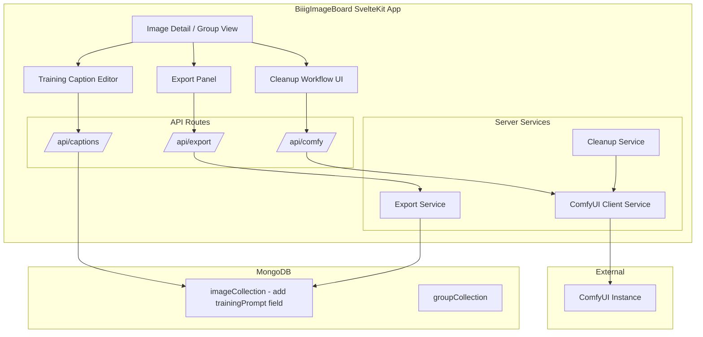

# Diffusion Training Prep - Feature Plan

## Overview

Add tools to BiiigImageBoard for organizing and preparing images for diffusion model training. This includes:
1. **Training Caption Management** - Per-image training captions stored in MongoDB, editable in the GUI
2. **ComfyUI Cleanup Integration** - Push images through ComfyUI API for watermark removal, upscaling, and img2img detail fixes
3. **Dataset Export** - Export images with `.txt` caption files for training

---

## Architecture Diagram



---

## Phase 1: Training Caption Management

### 1.1 Data Model Changes

**File: [`DocTypes.ts`](app/src/lib/types/DocTypes.ts)**

Add a `trainingPrompt` field to `BaseImage`:

```typescript
export interface BaseImage {
    // ... existing fields ...
    /** Training caption for diffusion model training (separate from embPrompt) */
    trainingPrompt?: string;
    /** Status of cleanup processing */
    cleanupStatus?: 'none' | 'pending' | 'processing' | 'completed' | 'failed';
}
```

### 1.2 API Routes

**New file: [`app/src/routes/api/captions/+server.ts`](app/src/routes/api/captions/+server.ts)**

- `POST` - Update `trainingPrompt` for a single image
- `GET` - Retrieve `trainingPrompt` for an image

**Extend: [`app/src/lib/server/controllers/imageController.ts`](app/src/lib/server/controllers/imageController.ts)**

Add `updateTrainingPrompt(imageId, prompt)` method.

### 1.3 UI - Training Caption Editor

**New component: [`app/src/lib/svelteComponents/trainingCaptionEditor.svelte`](app/src/lib/svelteComponents/trainingCaptionEditor.svelte)**

- Rich text editor for writing training prompts
- Character/token counter (useful for CLIP token limits ~75 tokens)
- "Copy from Embedded Prompt" button to seed from extracted metadata
- Auto-save on blur or explicit save button
- Preview of how the caption will look as a `.txt` file

**Integrate into: [`app/src/routes/posts/[slug]/+page.svelte`](app/src/routes/posts/[slug]/+page.svelte)**

Add a "Training Caption" section alongside the existing Tags and Embedded Prompt sections.

---

## Phase 2: ComfyUI Cleanup Integration

### 2.1 ComfyUI Client Service

**New file: [`app/src/lib/server/services/comfyUIClient.ts`](app/src/lib/server/services/comfyUIClient.ts)**

Core client that handles all ComfyUI API communication:

```typescript
class ComfyUIClient {
    private serverAddress: string; // e.g. "http://127.0.0.1:8188"

    // Upload image to ComfyUI's input directory
    async uploadImage(imageBuffer: Buffer, filename: string): Promise<string>;

    // Submit a workflow JSON to ComfyUI's queue
    async queuePrompt(workflow: object): Promise<string>; // returns prompt_id

    // Poll history endpoint for completion
    async getHistory(promptId: string): Promise<ComfyHistoryResult>;

    // Download output image from ComfyUI
    async getOutputImage(filename: string, subfolder: string): Promise<Buffer>;

    // High-level: send image through workflow, wait for result
    async processImage(imageBuffer: Buffer, workflow: object): Promise<Buffer>;
}
```

**Configuration** - ComfyUI server address stored in environment config (e.g., `COMFYUI_URL` or in a config file/page). The existing [`config`](app/src/routes/config/+page.svelte) page can be extended for this.

### 2.2 Cleanup Workflow Templates

**New directory: [`app/src/lib/server/services/workflows/`](app/src/lib/server/services/workflows/)**

Store ComfyUI API-format workflow JSON templates:

- **`watermarkRemoval.json`** - Workflow using inpainting to remove watermarks
- **`upscaling.json`** - Workflow using upscaler model (e.g., RealESRGAN, 4x)
- **`img2imgCleanup.json`** - Workflow for detail fixes (eyes, faces, artifacts) using img2img with low denoise

Each template will have placeholder node IDs that the service can parameterize (e.g., input image, denoise strength, upscale factor).

### 2.3 Cleanup Service

**New file: [`app/src/lib/server/services/cleanupService.ts`](app/src/lib/server/services/cleanupService.ts)**

Orchestrates cleanup operations. **Cleanup results create a new image entry linked to the original via the `related` field**, allowing before/after comparison before the user decides to keep or discard.

```typescript
class CleanupService {
    // Run a single cleanup operation on an image
    // Creates a new image doc linked via related[] field
    async cleanupImage(imageId: string, operation: CleanupOperation): Promise<CleanupResult>;

    // Run cleanup on multiple images (batch)
    async batchCleanup(imageIds: string[], operations: CleanupOperation[]): Promise<BatchCleanupResult>;

    // Get status of a cleanup job
    async getStatus(jobId: string): Promise<CleanupJobStatus>;
}

type CleanupOperation = 'watermark_removal' | 'upscale' | 'img2img_cleanup' | 'full_pipeline';
```

The `full_pipeline` operation chains: watermark removal -> img2img cleanup -> upscale. Each intermediate result is saved as a new linked image so the user can pick the best version.

### 2.4 Task Queue Extension

**Extend: [`app/src/lib/server/services/taskQueue/types.ts`](app/src/lib/server/services/taskQueue/types.ts)**

Add new task type:

```typescript
export type TaskType = 'thumbnail' | 'extract_prompt' | 'video_thumbnail' | 'cleanup';

export interface CleanupTaskPayload {
    imageId: string;
    imagePath: string;
    operation: CleanupOperation;
}
```

**Extend: [`app/src/lib/server/services/taskQueue/imageProcessor.ts`](app/src/lib/server/services/taskQueue/imageProcessor.ts)**

Add cleanup task processing alongside existing thumbnail and prompt extraction.

### 2.5 API Routes

**New file: [`app/src/routes/api/comfy/+server.ts`](app/src/routes/api/comfy/+server.ts)**

- `POST` - Submit cleanup job(s)
  - Body: `{ imageIds: string[], operation: 'watermark_removal' | 'upscale' | 'img2img_cleanup' | 'full_pipeline' }`
- `GET` - Check cleanup job status / ComfyUI connection status

### 2.6 UI - Cleanup Controls

**New component: [`app/src/lib/svelteComponents/cleanupControls.svelte`](app/src/lib/svelteComponents/cleanupControls.svelte)**

- Buttons for each cleanup operation (watermark removal, upscale, img2img cleanup, full pipeline)
- Progress indicator showing current status
- Before/after comparison view
- Configurable parameters (upscale factor, denoise strength)

**Integrate into image detail view: [`app/src/routes/posts/[slug]/+page.svelte`](app/src/routes/posts/[slug]/+page.svelte)**

**Extend batch operations in: [`app/src/lib/server/services/batchService.ts`](app/src/lib/server/services/batchService.ts)**

Add `'cleanup'` as a batch operation type so users can select multiple images and run cleanup.

---

## Phase 3: Dataset Export

### 3.1 Export Service

**New file: [`app/src/lib/server/services/exportService.ts`](app/src/lib/server/services/exportService.ts)**

```typescript
class ExportService {
    // Export a single image with its caption file
    async exportImage(imageId: string): Promise<{ image: Buffer, caption: string, filename: string }>;

    // Export a group of images as a zip archive
    async exportGroup(groupId: string): Promise<Buffer>; // zip buffer

    // Export selected images as a zip archive
    async exportSelected(imageIds: string[]): Promise<Buffer>;
}
```

The zip archive structure:
```
export_2026-06-07/
  image_001.png
  image_001.txt  (trainingPrompt content)
  image_002.png
  image_002.txt
  ...
```

### 3.2 API Routes

**New file: [`app/src/routes/api/export/+server.ts`](app/src/routes/api/export/+server.ts)**

- `POST` - Trigger export, returns a download URL or stream
  - Body: `{ imageIds?: string[], groupId?: string, format: 'zip' }`

### 3.3 UI - Export Panel

**New component: [`app/src/lib/svelteComponents/exportPanel.svelte`](app/src/lib/svelteComponents/exportPanel.svelte)**

- "Export as Dataset" button on group view and image detail view
- Preview of what will be exported (image list + caption preview)
- Option to export only images that have training captions set
- Download as zip

**Integrate into:**
- [`app/src/routes/posts/[slug]/+page.svelte`](app/src/routes/posts/[slug]/+page.svelte) - single image export
- Group view pages - batch export

---

## Implementation Order

1. **Phase 1** - Training Caption Management (foundation, no external dependencies)
   - Data model changes
   - Caption API
   - Caption editor UI
2. **Phase 2A** - ComfyUI Client Service (core integration)
   - ComfyUI client
   - Configuration
   - Connection test
3. **Phase 2B** - Cleanup Workflows and Service
   - Workflow templates
   - Cleanup service
   - Task queue integration
4. **Phase 2C** - Cleanup UI
   - Cleanup controls component
   - Batch cleanup integration
5. **Phase 3** - Dataset Export
   - Export service
   - Export API
   - Export UI

---

## Files to Create

| File | Purpose |
|------|---------|
| `app/src/lib/server/services/comfyUIClient.ts` | ComfyUI REST API client |
| `app/src/lib/server/services/cleanupService.ts` | Cleanup orchestration |
| `app/src/lib/server/services/exportService.ts` | Dataset export with caption files |
| `app/src/lib/server/services/workflows/watermarkRemoval.json` | ComfyUI workflow template |
| `app/src/lib/server/services/workflows/upscaling.json` | ComfyUI workflow template |
| `app/src/lib/server/services/workflows/img2imgCleanup.json` | ComfyUI workflow template |
| `app/src/routes/api/captions/+server.ts` | Training caption API |
| `app/src/routes/api/comfy/+server.ts` | ComfyUI cleanup API |
| `app/src/routes/api/export/+server.ts` | Dataset export API |
| `app/src/lib/svelteComponents/trainingCaptionEditor.svelte` | Caption editor UI |
| `app/src/lib/svelteComponents/cleanupControls.svelte` | Cleanup controls UI |
| `app/src/lib/svelteComponents/exportPanel.svelte` | Export panel UI |

## Files to Modify

| File | Change |
|------|--------|
| [`DocTypes.ts`](app/src/lib/types/DocTypes.ts) | Add `trainingPrompt`, `cleanupStatus` fields to `BaseImage` |
| [`imageController.ts`](app/src/lib/server/controllers/imageController.ts) | Add `updateTrainingPrompt()` method |
| [`imageModel.ts`](app/src/lib/server/models/imageModel.ts) | Support new fields in queries |
| [`types.ts`](app/src/lib/server/services/taskQueue/types.ts) | Add `cleanup` task type and payload |
| [`imageProcessor.ts`](app/src/lib/server/services/taskQueue/imageProcessor.ts) | Handle cleanup tasks |
| [`batchService.ts`](app/src/lib/server/services/batchService.ts) | Add cleanup batch operation |
| [`posts/[slug]/+page.svelte`](app/src/routes/posts/[slug]/+page.svelte) | Add caption editor and cleanup UI |
| [`config/+page.svelte`](app/src/routes/config/+page.svelte) | Add ComfyUI server URL config |

---

## Confirmed Decisions

1. **ComfyUI backend** - User has a running ComfyUI instance. Starter workflow templates will be created that can be customized later.
2. **Cleanup result handling** - New image entries are created linked to originals via the `related` field. Users compare before/after and approve or discard.
3. **Workflow templates** - No existing workflows. Starter templates for watermark removal, upscaling, and img2img cleanup will be created as ComfyUI API-format JSON.
4. **Training caption format** - Per-image `.txt` caption files for export. Data stored as `trainingPrompt` string in MongoDB per image document. Viewable and editable in the existing GUI.
5. **Export scope** - Export individual images or groups as `.zip` with paired image + caption `.txt` files.

## Remaining Open Items

- **ComfyUI models** - Which specific models are installed will determine the default workflow template parameters. The templates will use common defaults (RealESRGAN for upscale, SD inpainting for watermark removal) but are fully customizable.
- **ComfyUI server URL** - Will be configurable via environment variable `COMFYUI_URL` and/or the existing config page. Default: `http://127.0.0.1:8188`.
