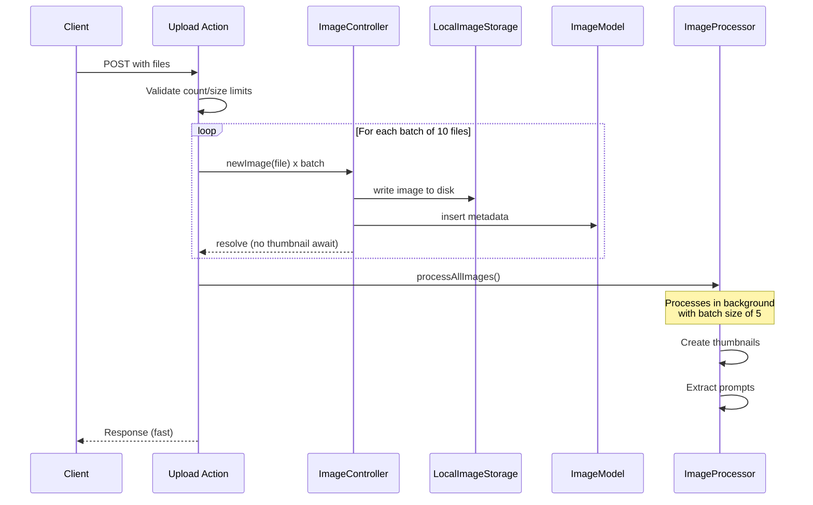

# Large Upload Optimization Plan

## Overview

This plan addresses handling uploads of 2,000+ images per request by adding concurrency control, deferring CPU-intensive work, and reducing peak memory usage. All changes follow existing architecture patterns (singleton services, adapter pattern, task queue system).

---

## Architecture Diagram



---

## Detailed Implementation Steps

### Step 1: Add upload configuration constants

**File:** [`app/src/routes/upload/+page.server.ts`](app/src/routes/upload/+page.server.ts)

Add configuration constants at the top of the file, following the existing import style:

```typescript
// Upload configuration
const UPLOAD_BATCH_SIZE = 10;          // Process 10 files at a time
const MAX_UPLOAD_COUNT = 5000;         // Max files per request
const MAX_FILE_SIZE = 50 * 1024 * 1024; // 50MB per file
const BATCH_DELAY_MS = 50;             // Delay between batches for GC
```

**Rationale:** Centralized config makes tuning easy. Values chosen based on ~100MB peak memory for 10 files at 5MB each.

---

### Step 2: Refactor `imageController.newImage()` to defer thumbnail generation

**File:** [`app/src/lib/server/controllers/imageController.ts`](app/src/lib/server/controllers/imageController.ts:131)

Current behavior: `newImage()` awaits thumbnail creation synchronously, blocking the upload promise.

**Change:** Remove synchronous thumbnail/prompt work. The image is saved to disk and DB only. Thumbnail generation is already handled by `imageProcessor.processAllImages()` which is called after uploads complete.

**Modified `newImage()` method:**

```typescript
async newImage(file: imgFile, uniqueID: string) {
    // process image data
    let buffer = Buffer.from(await file.arrayBuffer());
    let hash = await FileModel.hashFile(buffer);

    if (await ImageModel.uniqueHash(hash) > 0) {
        console.log(`Image already exists. _id:${hash} file.name:${file.name}`)
        console.log(hash);
        return null;
    }

    const supportedVideo = ["mp4", "webm"];
    let ext = file.name.split('.').pop() ?? "";
    let newFileName = `${uniqueID}.${ext}`;

    let type: "image" | "video" = supportedVideo.includes(ext) ? "video" : "image"

    const imageDataObj: AppImageData = {
        _id: hash,
        originalName: file.name,
        sanitizedFilename: newFileName,
        imagePath: `${this.defaultPath}${newFileName}`,
        uploadDate: uniqueID,
        thumbnailPath: "",
        group: [],
        tags: [],
        type: type
    }

    try {
        // Save image and DB record only - no thumbnail/prompt work here
        const dbResults = await this.addImage(imageDataObj, buffer);
        
        // Release buffer reference immediately to allow GC
        delete (buffer as any);
        
        return dbResults;
    } catch (error: any) {}
}
```

**What gets removed:**
- Lines 162-170: The `if(type === "video")` block with `createVideoThumbnail`
- Lines 165-170: The `else` block with `createThumbnail` and `extractPromptAsync`
- The `extractPromptAsync` private method can remain for now (used elsewhere potentially) or be removed in cleanup

**Rationale:** Thumbnails and prompt extraction are already handled by `imageProcessor.processAllImages()` which runs in the background. The synchronous work in `newImage()` was redundant and caused high memory/CPU usage during uploads.

---

### Step 3: Add batched processing with concurrency control to upload action

**File:** [`app/src/routes/upload/+page.server.ts`](app/src/routes/upload/+page.server.ts:7)

Replace the current `Promise.allSettled(files.map(...))` pattern with a batched loop:

```typescript
export const actions = {
    default: async ({ request }) => {
        const formdata = await request.formData();
        const files = formdata.getAll("image").filter(file => file instanceof File && file.name) as File[];
        const baseTimestamp = Date.now().toString();

        // Validate upload limits
        if (files.length > MAX_UPLOAD_COUNT) {
            return {
                success: false,
                submitted: 0,
                errors: [`Too many files: ${files.length}. Maximum is ${MAX_UPLOAD_COUNT}.`]
            };
        }

        for (const file of files) {
            if (file.size > MAX_FILE_SIZE) {
                return {
                    success: false,
                    submitted: 0,
                    errors: [`File ${file.name} exceeds size limit of ${MAX_FILE_SIZE / 1024 / 1024}MB.`]
                };
            }
        }

        // Process uploads in batches to control memory and concurrency
        const uploadResults: PromiseSettledResult<{ success: boolean; error?: string } | undefined>[] = [];

        for (let i = 0; i < files.length; i += UPLOAD_BATCH_SIZE) {
            const batch = files.slice(i, i + UPLOAD_BATCH_SIZE);
            const batchResults = await Promise.allSettled(batch.map(async (file, index) => {
                try {
                    const globalIndex = i + index;
                    const sequentialTimestamp = (parseInt(baseTimestamp) + globalIndex).toString();
                    await imageController.newImage(file, sequentialTimestamp);
                } catch (error) {
                    return { success: false, error: `Error processing file ${file.name}: ${error}` };
                }
            }));
            uploadResults.push(...batchResults);

            // Small delay between batches to allow GC and prevent CPU spikes
            if (i + UPLOAD_BATCH_SIZE < files.length) {
                await new Promise(resolve => setTimeout(resolve, BATCH_DELAY_MS));
            }
        }

        // Queue thumbnail generation for all uploaded images (non-blocking)
        imageProcessor.processAllImages().catch(err => {
            console.error("Thumbnail processing failed:", err);
        });

        // Check if all uploads succeeded
        const allSuccess = uploadResults.every(
            result => result.status === "fulfilled" && result.value?.success !== false
        );

        if (!allSuccess) {
            const errors = uploadResults
                .filter(result => result.status === "rejected" || (result.status === "fulfilled" && result.value?.success === false))
                .map(result => {
                    if (result.status === "rejected") return `Upload rejected: ${result.reason}`;
                    return result.value?.error || "Unknown error";
                });
            return { success: false, submitted: 0, errors };
        }

        return { success: true, submitted: files.length };
    }
};
```

**Rationale:** Processes files in batches of 10, limiting concurrent disk writes, DB inserts, and memory usage. The delay between batches allows the GC to reclaim memory from completed batches.

---

### Step 4: Set Sharp global concurrency limit

**File:** [`app/src/lib/server/services/fileUtilities/fileUtils.ts`](app/src/lib/server/services/fileUtilities/fileUtils.ts)

Add Sharp concurrency configuration at module level:

```typescript
import fs from "fs/promises"
import crypto from "crypto"
import sharp from "sharp"
import Ffmpeg from 'fluent-ffmpeg';
import path from "path";

// Limit concurrent Sharp operations to prevent CPU/memory overload
sharp.concurrency(5);
```

**Rationale:** Sharp spawns libvips workers for image processing. Without a limit, 2000 concurrent uploads could spawn 2000 workers, exhausting CPU and memory. A limit of 5 matches the existing `BATCH_SIZE` in `imageProcessor`.

---

### Step 5: Add file size and count validation in upload action

**File:** [`app/src/routes/upload/+page.server.ts`](app/src/routes/upload/+page.server.ts)

This is included in Step 3's code. The validation checks:
1. Total file count against `MAX_UPLOAD_COUNT`
2. Individual file size against `MAX_FILE_SIZE`

**Rationale:** Fails fast before consuming memory on oversized requests. Prevents DoS scenarios where a client uploads 100,000 files.

---

### Step 6: Update imageProcessor to handle deferred thumbnail tasks from uploads

**File:** [`app/src/lib/server/services/taskQueue/imageProcessor.ts`](app/src/lib/server/services/taskQueue/imageProcessor.ts)

The existing `imageProcessor.processAllImages()` already handles images with empty `thumbnailPath`. Since `newImage()` now sets `thumbnailPath: ""` and doesn't create thumbnails, the processor will pick them up correctly.

**Verify the query in [`findImagesNeedingProcessing()`](app/src/lib/server/services/taskQueue/imageProcessor.ts:50):**

The existing query at line 54-64 already matches images with `thumbnailPath: ''`:
```typescript
{ 
    $or: [
        { thumbnailPath: { $exists: false } },
        { thumbnailPath: '' },
        { thumbnailPath: null }
    ]
}
```

**No changes needed** - the existing logic correctly handles the deferred thumbnails.

**Optional enhancement:** Increase the `limit` parameter in `findImagesNeedingProcessing()` if the default 100 is too low for large uploads. Consider making it dynamic or removing the limit for upload-triggered processing.

---

### Step 7: Add buffer cleanup in `newImage()` to allow GC

**File:** [`app/src/lib/server/controllers/imageController.ts`](app/src/lib/server/controllers/imageController.ts:131)

This is included in Step 2's code. After `addImage()` completes:

```typescript
const dbResults = await this.addImage(imageDataObj, buffer);

// Release buffer reference immediately to allow GC
// The image is now on disk, buffer is no longer needed
buffer = Buffer.alloc(0);
```

**Rationale:** The buffer is a large heap allocation. Explicitly releasing it (or replacing with an empty buffer) allows the GC to reclaim memory before the next batch processes. This is especially important since the old code kept the buffer alive for `extractPromptAsync()`.

---

## File Change Summary

| File | Changes |
|------|---------|
| [`+page.server.ts`](app/src/routes/upload/+page.server.ts) | Add config constants, batched processing loop, validation |
| [`imageController.ts`](app/src/lib/server/controllers/imageController.ts) | Remove sync thumbnail/prompt work from `newImage()`, add buffer cleanup |
| [`fileUtils.ts`](app/src/lib/server/services/fileUtilities/fileUtils.ts) | Add `sharp.concurrency(5)` |
| [`imageProcessor.ts`](app/src/lib/server/services/taskQueue/imageProcessor.ts) | No changes needed (optional: increase query limit) |

---

## Memory Impact Estimates

| Scenario | Before | After |
|----------|--------|-------|
| 2000 files x 5MB | ~30GB peak | ~100MB peak (10 files x 5MB x 2 buffers) |
| Concurrent Sharp ops | 2000 | 5 |
| Concurrent disk writes | 2000 | 10 |
| Upload response time | Waits for all thumbnails | Returns after DB insert only |
| Thumbnail gen | During upload (blocking) | Background (non-blocking) |

---

## Risks and Mitigations

| Risk | Mitigation |
|------|-----------|
| `imageProcessor` doesn't process new images fast enough | Existing batch processing with 100ms delay is designed for this. Monitor queue depth. |
| Duplicate image detection still needs full buffer hash | Cannot avoid without streaming. Hash is fast (SHA256). Buffer released after hash. |
| Very large single files still spike memory | `MAX_FILE_SIZE` validation prevents this. |
| `formData()` still loads all files into memory | This is a SvelteKit/Node limitation. For true streaming, a future refactor to `busboy` would be needed (out of scope). |

---

## Implementation Order

1. **Step 4** - Sharp concurrency (quick win, low risk)
2. **Step 1** - Config constants (no behavior change)
3. **Step 5** - Validation (safety net)
4. **Step 2** - Refactor `newImage()` (core change)
5. **Step 3** - Batched upload action (core change)
6. **Step 7** - Buffer cleanup (completes Step 2)
7. **Step 6** - Verify imageProcessor works correctly (testing)
